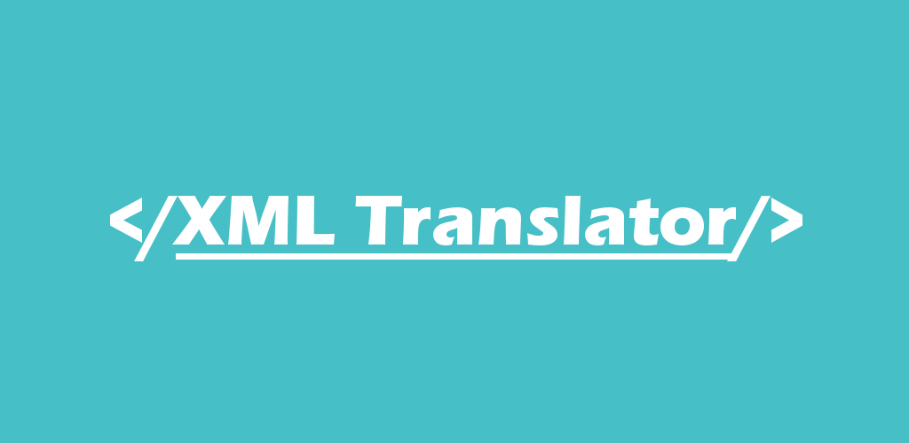

<a href='https://play.google.com/store/apps/details?id=com.jantzapps.jantz.xmltranslatorfree&pcampaignid=MKT-Other-global-all-co-prtnr-py-PartBadge-Mar2515-1'></a>

**XML Translator Free is perfect for translating Android apps into different languages in order to localize apps and increase their usage. Users are allowed to translate approximately 3,000 characters a day.**

**XML Translator Free lets users specify their Google Drive of choice and stores the output there. The format of the output allows users to simply paste the translation folders directly to the Android resource folder.**

**In order to change the text values between .xml tags, just choose the language of the .xml that is to be translated, choose the language or languages that you would like to receive , then copy and paste .xml markup into XML Translator Free.**

**This app works, that is why it is available in 92 different languages. It has translated itself! Parsing and translating .xml files has never been easier than it is now, thanks to XML Translator Free. Get ready to enjoy a much easier way to translate!**


## Built With

* [Google Drive](https://developers.google.com/drive/) - File management api
* [Yandex Translate](https://tech.yandex.com/translate/) - Character translation service
* [Caligraphy](https://github.com/InflationX/Calligraphy) - Font-family library

## License

```
All Rights Reserved
```
